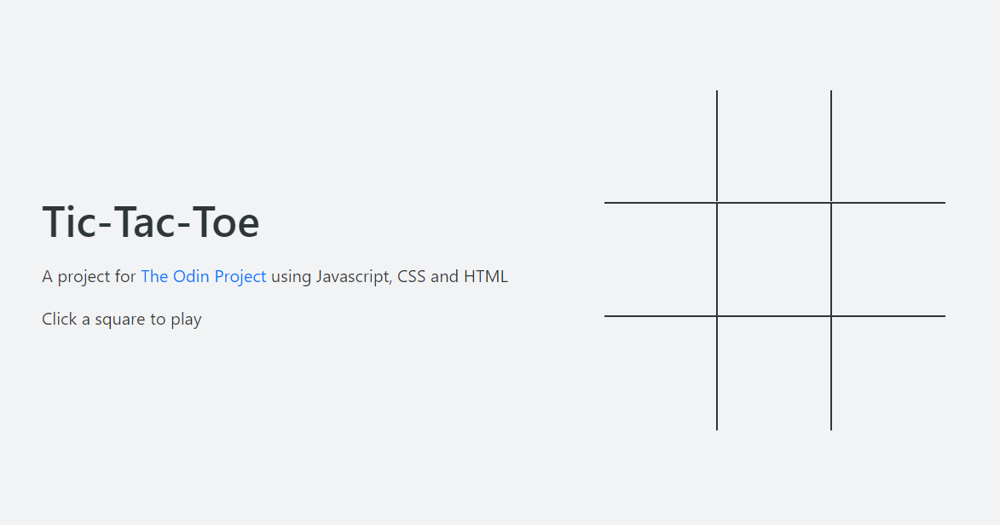

# tic-tac-toe
## The Odin Project: Tic-Tac-Toe
Assignment for [The Odin Project](https://www.theodinproject.com) - Tic-Tac-Toe

## Technologies used
* HTML
* Javascript
* CSS
* [marx.css](https://mblode.github.io/marx/)

## Attributes
* Icons by [Pixel perfect](https://www.flaticon.com/authors/pixel-perfect)
* Icons by [Freepik](https://www.flaticon.com/authors/freepik)
* Icons by [gorbachev](https://www.flaticon.com/authors/vitaly-gorbachev)

## Screenshots

## Demo
You can view a live demo [here](https://furnapso.github.io/tic-tac-toe/)